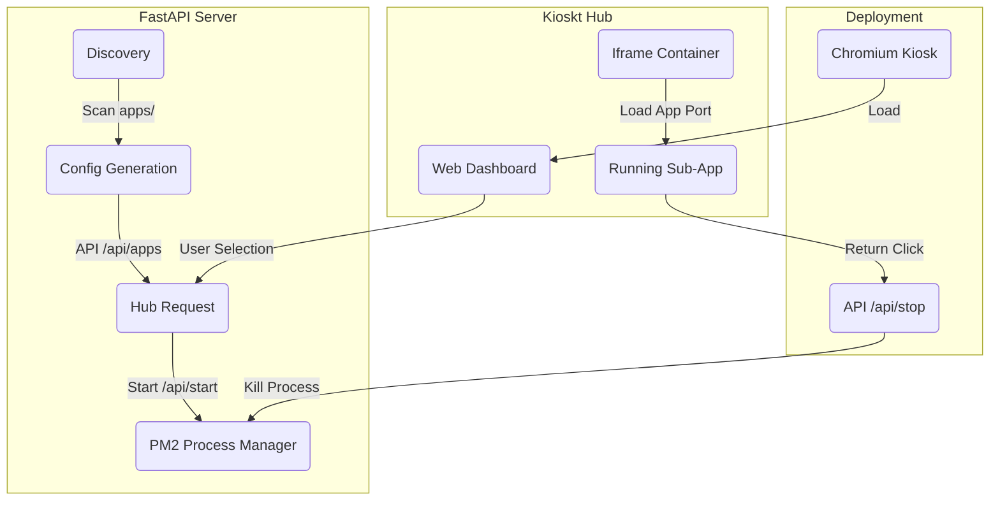

# Kioskt
#### Created by Kaléin Tamaríz

[](https://fastapi.tiangolo.com/)
[](https://www.python.org/)
[](https://pm2.keymetrics.io/)
[](https://www.chromium.org/)
[](https://releases.ubuntu.com/jammy/)


## Abstract

**Kioskt** is a sleek, general-purpose kiosk management system designed to provide a centralized Hub for launching and managing multiple web applications. The system automatically discovers sub-applications in a dedicated directory, manages their lifecycle using PM2, and serves them within a secure iframe-based kiosk environment.

**_This repo was tested on Ubuntu 22.04 LTS._**

----

## Features

- **Dynamic App Discovery:** Automatically scans the `apps/` directory for new web applications or external URLs.
- **Unified Hub Interface:** A high-performance, animated dashboard for easy application selection.
- **Process Management:** Leverages **PM2** to reliably start, stop, and restart sub-applications.
- **Automatic Port Assignment:** Dynamically assigns unique ports to discovered apps using MD5 hashing to avoid collisions.
- **Kiosk Mode Deployment:** Includes scripts to launch Chromium in a locked-down kiosk mode with custom screen positioning.
- **Integrated Return System:** Allows users to easily switch back to the main Hub from any running application.

----
## Flowchart



---
## Table of Contents

- [Information sources](#information-sources)
- [Requirements](#requirements)
   - [Hardware](#hardware)
   - [Software](#software)
- [Installation](#installation)
- [Project Structure](#project-structure)
- [Usage or Quick start](#usage-or-quick-start)
- [Troubleshooting](#troubleshooting)
- [Contributing](#contributing)
- [License](#license)
- [Credits](#credits)

----
## Information sources

- **FastAPI Documentation:** [https://fastapi.tiangolo.com/](https://fastapi.tiangolo.com/)
- **PM2 Documentation:** [https://pm2.keymetrics.io/docs/usage/quick-start/](https://pm2.keymetrics.io/docs/usage/quick-start/)
- **Chromium Kiosk Flags:** [https://peter.sh/experiments/chromium-command-line-switches/](https://peter.sh/experiments/chromium-command-line-switches/)

---
## Requirements

### Hardware
- Display (optimized for 1080p or specific kiosk monitors).
- Internet connection (if launching external URL apps).


### Software
- **OS:** Ubuntu 22.04 LTS
- **Python:** 3.10+
- **Browser:** Chromium Browser
- **Process Manager:** PM2 (Node.js/NPM required)


---
## Installation (If needed)

**Clone the repository**

```bash
git clone <repository-url>
cd kioskt
```

**Install dependencies**

```bash
# Install Python dependencies
pip install fastapi uvicorn

# Install PM2 (requires Node.js)
sudo apt install nodejs npm
sudo npm install -g pm2

# Install Chromium
sudo apt install chromium-browser
```

---
## Project Structure

```bash
kioskt
├── apps/                # Directory for sub-applications
│   ├── Roulette/        # Sample app
│   ├── Slot Machine/    # Sample app
│   └── videos/          # Video player app
├── deploy/
│   └── kioskt.sh        # Main deployment script
├── static/
│   ├── index.html       # Hub frontend
│   └── return.png       # Navigation icon
├── hub_backend.py       # FastAPI application manager
└── README.md            # Project documentation
```

---
## Usage or Quick start

**Starting the Hub**

The easiest way to start the system is using the provided deployment script:

```bash
bash deploy/kioskt.sh
```

This will:
1. Start the `hub_backend.py` on port 8000.
2. Launch Chromium in Kiosk mode.
3. Automatically load the Kioskt Hub.

**Adding a New App**
To add a new application, simply create a folder in `apps/`.
- If it contains a `deploy/*.sh` file, it will be executed via PM2.
- If it's a simple directory, it will be served as a static site.
- You can also add a `url.txt` file to launch an external website in the iframe.

---
## Troubleshooting

**Problem:** Sub-app doesn't load in the iframe.
**Solution:** Check if the app port is blocked or if there is a "Refused to display in a frame" X-Frame-Options error on the target app.

**Problem:** PM2 command not found.
**Solution:** Ensure `npm install -g pm2` was successful and the path is in your environment variables.

---
## Credits

+ **Author:** <span style="color:green">Kaléin Tamaríz</span> (Created by Kaléin Tamaríz)

+ **Maintainer:** Dr. Miguel Rangel
