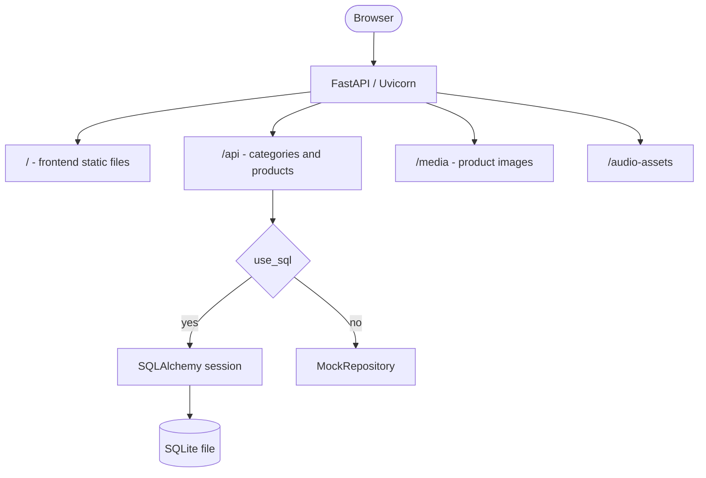

<!--
# Authors: Mauricio Arteaga
# Kaléin Tamaríz
-->

# Products and Surveys Catalog

[](https://www.python.org/)
[](https://fastapi.tiangolo.com/)


## Abstract

The Products and Surveys Catalog is a comprehensive web application designed to serve as a digital catalog for products and related surveys. It features a responsive frontend interface and a robust FastAPI backend that reads catalog data from a SQLite database produced by the companion project **productsandsurveys_dashboard_back**, with a built-in fallback to in-process mock data when that database is unavailable or empty so the UI and API keep working for local development and demos.

**_This repository was tested on Ubuntu 22.04 LTS and Ubuntu 24.04 LTS._**

----

## Features

- ***FastAPI Backend*** – High-performance API serving categories and product data.
- ***Dynamic Data Source*** – Uses SQLAlchemy for SQLite database connectivity with a seamless fallback to a local mock repository if the database is missing or empty.
- ***Automated Installation*** – Includes a comprehensive `installer.sh` script that configures system dependencies, `uv` virtual environments, local SSL certificates via `mkcert`, and downloads frontend assets.
- ***Responsive Frontend*** – Integrated frontend interface using Bootstrap 5, served directly from the backend.

----
## Flowchart



---
## Table of Contents

- [Information sources](#information-sources)
- [Requirements](#requirements)
- [Installation](#installation)
- [Project Structure](#project-structure)
- [Backend data layer](#backend-data-layer)
- [Usage or Quick start](#usage-or-quick-start)
- [Deployment](#deployment)
- [Troubleshooting](#troubleshooting)
- [Credits](#credits)

----
## Information sources

- FastAPI: https://fastapi.tiangolo.com/
- SQLAlchemy: https://www.sqlalchemy.org/
- Uvicorn: https://www.uvicorn.org/
- uv (Astral): https://github.com/astral-sh/uv

---
## Requirements

- A recent Debian-based distribution (for example Ubuntu); the installer assumes `apt`.
- Python 3.12+
- `curl`, `sqlite3`, `libnss3-tools`

---
## Installation

**Clone the repository**

```bash
git clone <repository-url>
```

**Run the installer script**

The repository includes an automated installer that handles system packages, virtual environment (`uv`), SSL certificates (`mkcert`), `.env` configuration, and frontend dependencies.

```bash
cd productsandsurveys_catalog
chmod +x installer.sh
./installer.sh
```

You can also use flags to clear the virtual environment or overwrite the `.env` file:
```bash
./installer.sh --clear --overwrite
```

> [!IMPORTANT]
> **Verify `backend/.env`:** Ensure `DATABASE_URL` and `EXTERNAL_IMAGE_PATH` match your **productsandsurveys_dashboard_back** checkout (or your overrides). Wrong paths put the app in **fallback** mock mode; use `GET /api/db-status` to confirm. Details: [Backend data layer](#backend-data-layer).

---
## Project Structure

```bash
productsandsurveys_catalog
├── backend
│   ├── apps                 # API routers and models
│   ├── certs                # SSL certificates (generated)
│   ├── db.py                # Database connection
│   ├── main.py              # FastAPI application entry point
│   └── repositories.py      # Mock data repository
├── deploy                   # Deployment configurations
├── frontend
│   ├── assets               # CSS/JS (downloaded via installer)
│   ├── index.html           # Main UI template
│   └── media/products       # Product images
├── installer.sh             # Bash installation script
├── standalone_deploy        # Standalone / PM2 helper scripts
├── requirements.txt         # Python dependencies
└── README.md                # Project documentation
```

The default `DATABASE_URL` points at SQLite under **productsandsurveys_dashboard_back**, not a file committed here (`*.db` is gitignored). See [Backend data layer](#backend-data-layer).

---
## Backend data layer

### Relationship to `productsandsurveys_dashboard_back`

This repository **does not create or migrate** the production catalog database. Schema creation, seeding, and ongoing writes to categories, products, and media metadata are expected to happen in **productsandsurveys_dashboard_back**, which maintains the SQLite file (commonly `products_surveys.db`) and the on-disk media trees this app points at.

The installer-generated `backend/.env` wires the catalog to that layout by default, for example:

- `DATABASE_URL` → `sqlite:////home/<user>/productsandsurveys_dashboard_back/products_surveys.db`
- `EXTERNAL_IMAGE_PATH` → dashboard-backed product images (e.g. `.../productsandsurveys_dashboard_back/media/products`)
- `EXTERNAL_AUDIO_PATH` (optional) → dashboard-backed audio assets used when SQL mode is active

The ORM models in `backend/apps/catalog/models.py` (`Category`, `Product`, `ProductMedia`, and the `product_categories` association table) are the read side of the same relational model the dashboard project owns.

### SQL mode vs fallback mode

Startup logic in `backend/main.py` sets a boolean `use_sql` **once at import time** after reading `DATABASE_URL`:

1. **No `DATABASE_URL`** – SQLAlchemy is never initialized (`SessionLocal` stays `None` in `db.py`); the app stays in fallback mode.
2. **URL present** – A short-lived session runs probe queries against `Product`, `Category`, and `ProductMedia` to verify connectivity and that the schema matches expectations.
3. **Failure** (missing file, wrong schema, driver error, etc.) – `use_sql` is cleared, the exception message is retained, and the app logs a warning.
4. **Success but empty catalog** – If the first `Product` row is `NULL`, the database is treated as “not usable for display” and the app **still** falls back to mock data (same as failure from the API consumer’s perspective: mock endpoints, local static paths).

**When `use_sql` is true**

- The FastAPI router in `backend/apps/catalog/routers.py` is mounted under `/api`. Endpoints use `Depends(get_db)` so each request gets a SQLAlchemy `Session` from the pool bound to the configured engine.
- `GET /api/categories` returns all category rows serialized with Pydantic (`CategorySchema`).
- `GET /api/products` optionally filters by `category_id` via a join on the many-to-many relationship; each product aggregates category names and `ProductMedia` rows. Relative `media_url` values are rewritten with `BASE_MEDIA_URL` when they are not already absolute.
- Static file mounts: `/media` serves files from `EXTERNAL_IMAGE_PATH`; `/audio-assets` serves from `EXTERNAL_AUDIO_PATH` (with a default path under the dashboard repo if unset).

**When `use_sql` is false (fallback mode)**

- The SQL router is **not** registered. Instead, equivalent handlers are defined inline and delegate to `MockRepository` in `backend/repositories.py`: fixed in-memory category and product lists, a synthetic junction table, and media URLs built as `{BASE_MEDIA_URL}/{filename}` against files shipped under `frontend/media/products`.
- Static mounts switch to repository-local directories: `frontend/media/products` for images and `frontend/media/audios` for audio, so the SPA can be exercised without the dashboard database or external media paths.

In both modes the public route shape stays `/api/categories` and `/api/products`, and the SPA plus `/media` and `/audio-assets` keep consistent URL semantics.

### Operational introspection

`GET /api/db-status` returns JSON describing the bootstrap outcome: `status` is `"connected"` when SQL mode is active and `"fallback"` otherwise. The `error` field holds the message from the last connection or schema probe **only when an exception occurred**; an empty but valid database still yields fallback mode with `error` typically unset (`null`).

---
## Usage or Quick start

Once the installation is complete, activate the virtual environment and run the backend server.

```bash
cd backend
source .venv/bin/activate
uvicorn main:app --host 0.0.0.0 --port 9999
```

Access the application at: `http://localhost:9999`

---
## Deployment

The catalog can run on its own (standalone) or as an app inside the kiosk shell.

### Standalone mode (PM2)

For a standalone machine, create the PM2 process using the bash script in `standalone_deploy/` (for example `Catalog_PnS.sh`). That script activates the backend virtual environment, starts Uvicorn, and launches Chromium in kiosk mode pointed at the local catalog URL.

1. Install [PM2](https://pm2.keymetrics.io/) if it is not already available on the host.
2. Make the script executable and start it under PM2 from the repository root:

```bash
chmod +x standalone_deploy/Catalog_PnS.sh
pm2 start standalone_deploy/Catalog_PnS.sh
```

Adjust `SCRIPT_DIR` inside the script if your clone does not live at `/home/$USER/productsandsurveys_catalog/`. Use `pm2 save` and your usual startup hook so the process comes back after a reboot.

### Kiosk host integration

If you deploy through the kiosk application instead of PM2 on this repo alone, copy the **entire** catalog project directory into `kioskt/apps/` inside the kiosk project. The kiosk discovers apps in that folder and registers them automatically—no extra wiring is required beyond placing the folder there.

---
## Troubleshooting

**Problem:** `mkcert` command not found during installation.
**Solution:** Ensure you have an active internet connection and that the installer correctly installed `mkcert` via apt, or install it manually.

**Problem:** Images are not displaying in the catalog.
**Solution:** Check the `backend/.env` file and ensure the `EXTERNAL_IMAGE_PATH` variable correctly points to `/home/thebigduke/productsandsurveys_dashboard_back/media/products` or your designated images folder.

**Problem:** The catalog shows demo products instead of the real catalog, or images come from `frontend/media`.
**Solution:** Call `GET /api/db-status`. If `status` is `fallback`, fix `DATABASE_URL` (file must exist, schema must match, and there must be at least one product row) or populate the database from **productsandsurveys_dashboard_back**. See [Backend data layer](#backend-data-layer).

## Credits

**Author:** Kaléin Tamaríz

---
Return to [Table of Contents](#table-of-contents)
